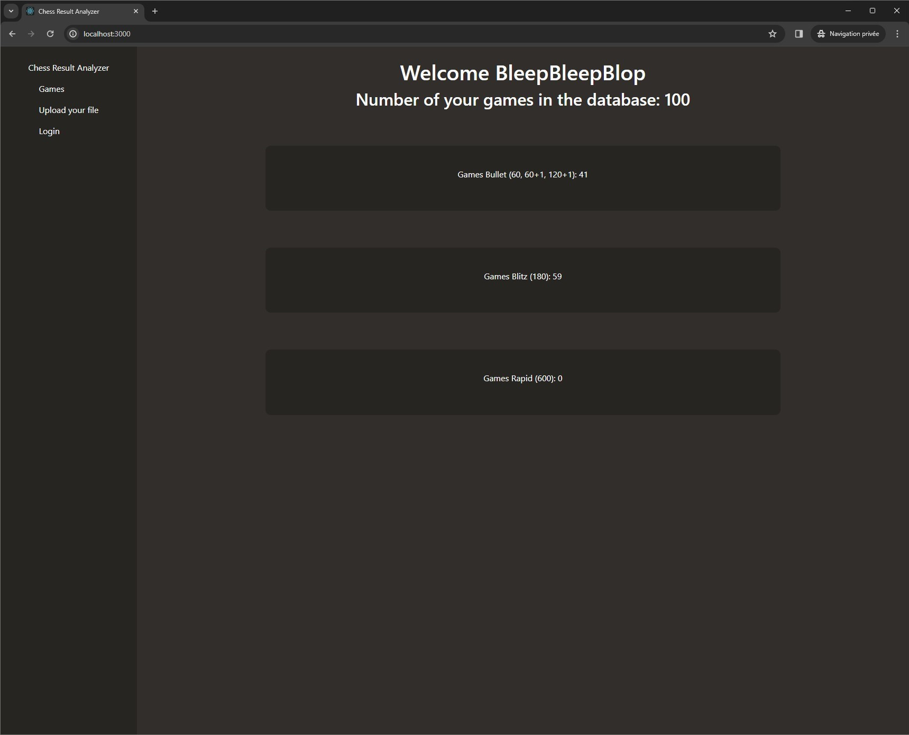

# MERN

## The project

The purpose of this project is to visualize your chess game stats, The application is built with a node.JS express backend API and a React frontend interface

## How it works

You need to download the .pgn file from Chess.com, you can upload it with the front (or with Postman if you prefer)

Once the file is sent on the backend, you can see the number of games you played for each category 

## Other

It is the same than the C# / Angular or Java / Angular that you can find here
- https://github.com/jorisreynes/LinqProject-API
- https://github.com/jorisreynes/ChessResultAnalyzerJava
- https://github.com/jorisreynes/LinqProject-Angular

This project is not finished because finally there is a Chess.com API with more data than what we have in the .pgn file, so the backend is not needed anymore, 

There is a new version, frontend only, of this project here : https://github.com/jorisreynes/ChessGameStats

## How to install it : 

```
git clone https://github.com/jorisreynes/mern.git
```

```
cd mern
```

To open it with VS Code
```
code .
```

In the terminal
```
npm install
```

To launch the frontend
```
npm run start
```

To launch the backend
```
cd backend
```

```
npm run start
```

Open http://localhost:3000 with your browser

(the database is a MongoDB Atlas cluster and can be paused due to inactivity)


